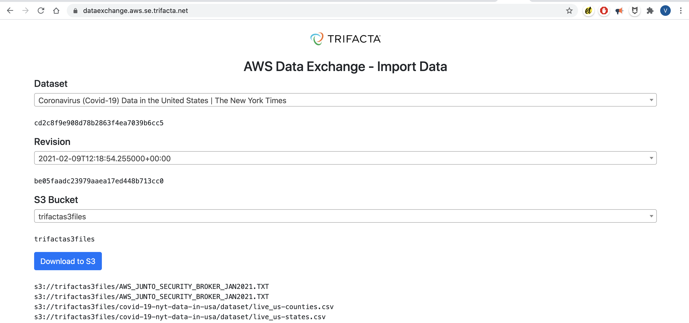

# trifacta-dataexchange

Mini application that allows a user to pick an AWS Data Exchange dataset and revision they have subscribed to. The user can download assets into a specified S3 bucket.

The solution is available as a deployable package. To deploy it into your own AWS account, install the [aws cli](https://docs.aws.amazon.com/cli/latest/userguide/install-cliv2.html) and [sam cli](https://docs.aws.amazon.com/serverless-application-model/latest/developerguide/serverless-sam-cli-install.html), then use the following commands:
```bash
git clone https://github.com/vbalasu/trifacta-dataexchange.git
cd trifacta-dataexchange/dist/
sam deploy --guided
```

This creates a CloudFormation stack with all the necessary resources. After stack creation, you can access the Endpoint URL from Outputs tab. All the resources are serverless, which means that they will cost just a fraction of a penny (if you exceed the generous free tier)

