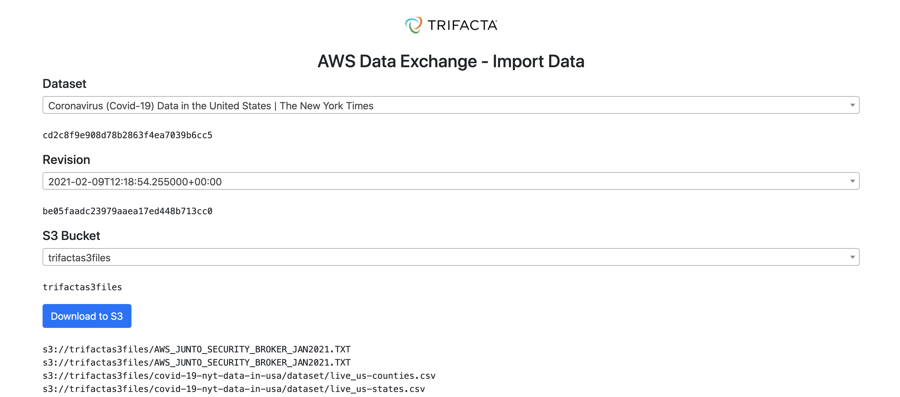

# trifacta-dataexchange

Mini application that allows a user to pick an AWS Data Exchange dataset and revision they have subscribed to. The user can download assets into a specified S3 bucket.

This solution is running at [https://dataexchange.aws.se.trifacta.net](https://dataexchange.aws.se.trifacta.net) and [https://dataexchange.amer.trifacta.net](https://dataexchange.amer.trifacta.net)

The solution is also available as a deployable package - see the `dist` folder. You can deploy it into your own AWS account using the following command
```bash
sam deploy --guided
```

